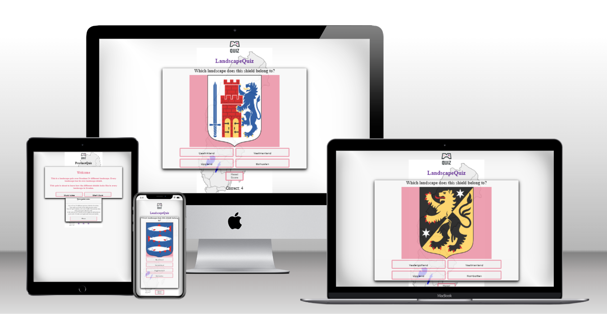

# Province quiz of shields 

**Province quiz** is a image-based quiz game over the shields representaiting every province in Sweden. Every provinces has it own unique shield. Total in Sweden there is 25 differens provinces.

The goal is to get as many correct answers over the province shilds. You will get a image of the province shield, and four different names of province, only one is correct. When you answer, you will get your point and get a new shield-image from another province in Sweden.

## UXD User experience Design
***
This image quiz game is for you when you have spare time and want to learn what name each province-shield have. It will allow you to see some beautiful and colorful image och province-shild. Everyone have its own story and meaning. To make it more inlearning, the image is random selected, so even if you refrech, you will get them in a different order.

### User Goals

User is looking for a nice colorful province-shield quiz whit all of Swedens provinces. In the bottom you will se your score.

### Project goals

Making it apear as a simpel quiz game, it will make this game more fun, and whant you to come back and se if you can get at better score next time.

- User get play info, how to play
- User can close the info easy
- User can start playing whit one click
- User can reset the result
- User can se how well its going

### Scope

The aim of this project was to use vanilla JavaScript and creat a image-base quiz. I decided to go ahead with a imgae-based quiz with random image of province shields of Sweden.

Features include:
- pop-up information of game rules
- clear score result
- start game button
- Score tracker, increment score

### Structure

- Index page
- - Title
- - Info button
- - Quiz start button
- - Backround image of sweden whit its stucture of provinces.

- Game page
- - Title
- - Reset result button
- - Box with image of province shield
- - Inside the box, four aswers buttons
- - Score of win and loses

### Skeleton

Quiz has a very simple, and easy-to-follow skeleton with only two pages. Wireframe have been used to make the layout. 

### Surface

Colors

## Features
***
### Existing featur
- User want to play the game.
    - Featur: Game starts when click button.

- User answer question, correct or wrong
    - Featur: Score is updated

- User want to keep track of score
    - Score is tracked at the bottom of the page.

- User accidential refrech site.
    - Score is there, if user cache is still saved.

- User whant to clear the score.
    - Score is cleared when button is pressed.

### Future features
- get sounds if correct answer
- get a visual on the button when the answer is right or wrong.
- maka a highscore whit input name.

## Technologies and Resources Used
***
### Languages

[HTML](https://html.com/): HyperText Markup Language. It is the language used as the basis of building websites and provides the main structure and format to the site.

[CSS](https://www.w3.org/Style/CSS/Overview.en.html): Cascading Style Sheets. It's the language used to make the web elements look better. It adds colour, positioning, fonts etc.

[JavaScript](https://www.w3schools.com/js/): JavaScript gets more interaction for the user. 

This project uses vanilla JavaScript, meaning no external frameworks have been used.

### Programmes and Libraries Used

- [Balsamiq](https://balsamiq.com/tutorials/) used to build framework.
- [Chrome devtools](https://developer.chrome.com/docs/devtools/) The console was used ofren to detect errors and ensure my code was functioning.
- [Font Awesome](https://fontawesome.com/) used to source social media icons
- [Git](https://git-scm.com/) used for version control of my site and pushing code to GitHub
- [GitHub](https://github.com/) the cloud storage system for my projects. The location of this site's repository, and place to deploy site.
- [GitPod](https://gitpod.io/) the IDE used to write and preview the code for this website.
- [Coolers]() used to pick my colours for the website.
- [Favicon](https://favicon.io/emoji-favicons/giraffe) used to make the favicon in the browser tab of the website.

### Resources for my code

I relied the Love Maths project and lessons provided from the Code Institute. 
I used a some tutors from youtube to get ideas for the quiz.

## Testing
***
### Validator Tests

- HTML was validated using [W3C markup validator](https://validator.w3.org/).  

    #### index.html     
    - On the first validation there were 3 error types returned in the beginning, but how now been fixed.
    - The most recent validation shows no errors. Details [here](docs/testing/w3-validator_index.png).  

    #### guiz.html
    - The first validation of this html file returned the same errors as index.html and the same changes were made.
    - The most recent validation shows no errors. Details [here](docs/testing/w3-validator_quiz.png).  

- CSS was validated using [W3C CSS validator](https://jigsaw.w3.org/css-validator/).  
No errors were returned ([see here](docs/testing/wave_quiz.png)), ([see here](docs/testing/w3-validator_index.png)). 

- JavaScript was validated using [JSHint](https://jshint.com/).   
Configure settings were changed to accept ES6 Javascript features  
    - intro.js first returned minor syntax errors regarding missing or incorrectly placed semi colons. These were fixed and subsequently no errors were returned. Details of latest results [here](docs/testing/jshint_intro.png) 
    - script.js first returned minor syntax errors regarding missing or incorrectly placed semi colons. These were fixed and subsequently no errors were returned. Details of latest results [here](docs/testing/jshint_script.png) 

### Accessibility test

- Accessibility of the site was tested with [WAVE (Web Accessibility Evaluation Tool)](https://wave.webaim.org/).  
index.html results are the same as the quiz. No errors were returned and no contrast issues were detected.
quiz.html results are [here](docs/testing/wave_quiz.png). No errors or contrast errors were returned. 

### Performance test

- Performance was tested with [lighthouse](https://developers.google.com/web/tools/lighthouse/run) and [webpage test](https://www.webpagetest.org/).  
  
Lighthouse mobile results [here](docs/testing/lighthouse_mobile_quiz.png).  
Webbpagetest was "Not bad" for the page.

### Manual testing

The live link was sent to multiple people for feedback on functionality and design.  
I played through the game myself repeatedly in search of errors and improvements. There is still some to fix.  

| Feature              | Expected outcome                                                                                  | Does it work?  |
| -------------        |:-------------:                                                                                    | -----:|
| Title logo           | Appears at the top of both pages. On the game page it redirects to the landing page if clicked.   |  Yes  |
| Start quiz button    | Brings user to the start of the game.                                                             |  Yes  |
| Quiz rules button    | Displays instructions on screen for how to play the game.                                         |  Yes  |
| Reset score button   | When user clicks, it will reset the score to zero (0).                                            |  Yes  |
| Score tally          |  Displays '0' if never played before or score was reset, and should display previous score so long as user hasn't cleared cache.   |  Yes     |
| Scenario change      |  When user clicks an option, the scenario changes to the appropriate follow-up scenario.          |   No  | 

## Bugs
***
### Fixed / Solved

- Image didn't come up in the beginning. change the source of the image, cause in the beginning the image was created in style.css, but then it was greated inside game.html page.
- The quiz started at the same place everytime. So fixed a random number. And after that added +1 to math, cause the quiz id starts with 1.

### Still existing

- The `innerHTML` is building up more and more pictures. Not time to find where to place the `remove()` function.

## Deployment
***
### Version Control
The site was created using the Visual Studio code editor and pushed to github to the remote repository ‘landscapequiz’.

The following git commands were used throughout development to push code to the remote repo:

`git add .` - This command was used to add the file(s) to the staging area before they are committed.

` git commit -m “commit message”` - This command was used to commit changes to the local repository queue ready for the final step.

`git push` - This command was used to push all committed code to the remote repository on github.

### Deployment to Github Pages
- The site was deployed to GitHub pages. The steps to deploy are as follows:
    - In the GitHub repository, navigate to the Settings tab
    - From the menu on left select 'Pages'
    - From the source section drop-down menu, select the Branch: main
    - Click 'Save'
    - A live link will be displayed in a green banner when published successfully.

The live link can be found here - https://groundbuilder.github.io/landscapequiz/

### Clone the Repository Code Locally
Navigate to the GitHub Repository you want to clone to use locally:

Click on the code drop down button
- Click on HTTPS
- Copy the repository link to the clipboard
- Open your IDE of choice (git must be installed for the next steps)
- Type git clone copied-git-url into the IDE terminal

The project will now of been cloned on your local machine for use.

## Credits
***
### Content

- [W3school](https://www.w3schools.com/) find how to fix a Modal.
- [Favicon](http://favicon.io/) To make icon to browser-tab.
- [MDN.Web.docs](https://developer.mozilla.org/en-US/docs/Web/API/Storage) To make a storage function.
- [Youtube.1](https://www.youtube.com/watch?v=ykszkgydoG4&list=FLruW0TYzckk7aRMpw8_TgFg&index=1) To make random question.
- [Youtube.2](https://www.youtube.com/watch?v=R1S_NhKkvGA) To make strukture of quiz.
- [W3school](https://www.w3schools.com/howto/tryit.asp?filename=tryhow_js_progressbar_3) To make a progress bar.
- Increment

How to creat Modals
https://www.w3schools.com/howto/howto_css_modals.asp

### Media
- All the images of province shields in the site was taken from [Wikipedi](https://www.wikipedia.org/)

## Acknowledgements
***
A huge thank you to my mentor Gareth for your help and support that kept me motivated.