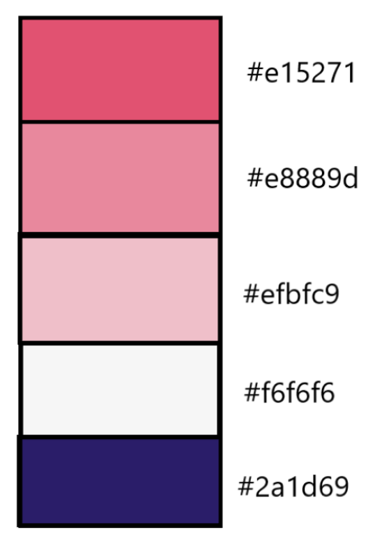

# Province quiz of shields 

**Province quiz** is a image-based quiz game over the shields representaiting every province in Sweden. Every provinces has it own unique shield. Total in Sweden there is 25 differens provinces.

The goal is to get as many correct answers over the province shilds. You will get a image of the province shield, and four different names of province, only one is correct. When you answer, you will get your point and get a new shield-image from another province in Sweden.

## UXD User experience Design

This image quiz game is for you when you have spare time and want to learn what name each province-shield have. It will allow you to see some beautiful and colorful image och province-shild. Everyone have its own story and meaning. To make it more inlearning, the image is random selected, so even if you refrech, you will get them in a different order.

### User Goals

User is looking for a nice colorful province-shield quiz whit all of Swedens provinces. In the bottom you will se your score.

### Project goals

Making it apear as a simpel quiz game, it will make this game more fun, and whant you to come back and se if you can get at better score next time.

- User get play info, how to play
- User can close the info easy
- User can start playing whit one click
- User can reset the result
- User can se how well its going

### Scope

The aim of this project was to use vanilla JavaScript and creat a image-base quiz. I decided to go ahead with a imgae-based quiz with random image of province shields of Sweden.

Features include:
- pop-up information of game rules
- clear score result
- start game button
- Score tracker, increment score

### Structure

- Index page
- - Title
- - Info button
- - Quiz start button
- - Backround image of sweden whit its stucture of provinces.

- Game page
- - Title
- - Reset result button
- - Box with image of province shield
- - Inside the box, four aswers buttons
- - Score of win and loses

### Skeleton

Quiz has a very simple, and easy-to-follow skeleton with only two pages. Wireframe have been used to make the layout. 

### Surface

Colors

## Bugs

### Fixed / Solved

- Image didn't come up in the beginning. change the source of the image, cause in the beginning the image was created in style.css, but then it was greated inside game.html page.
- The quiz started at the same place everytime. So fixed a random number. And after that added +1 to math, cause the quiz id starts with 1.

### Still existing

- The `innerHTML` is building up more and more pictures. Not time to find where to place the `remove()` function.

## Deployment

### Version Control
The site was created using the Visual Studio code editor and pushed to github to the remote repository ‘landscapequiz’.

The following git commands were used throughout development to push code to the remote repo:

`git add .` - This command was used to add the file(s) to the staging area before they are committed.

` git commit -m “commit message”` - This command was used to commit changes to the local repository queue ready for the final step.

`git push` - This command was used to push all committed code to the remote repository on github.

### Deployment to Github Pages
- The site was deployed to GitHub pages. The steps to deploy are as follows:
    - In the GitHub repository, navigate to the Settings tab
    - From the menu on left select 'Pages'
    - From the source section drop-down menu, select the Branch: main
    - Click 'Save'
    - A live link will be displayed in a green banner when published successfully.

The live link can be found here - https://groundbuilder.github.io/landscapequiz/

### Clone the Repository Code Locally
Navigate to the GitHub Repository you want to clone to use locally:

Click on the code drop down button
- Click on HTTPS
- Copy the repository link to the clipboard
- Open your IDE of choice (git must be installed for the next steps)
- Type git clone copied-git-url into the IDE terminal

The project will now of been cloned on your local machine for use.

## Credits

### Content

- [W3school](https://www.w3schools.com/) find how to fix a Modal.
- [Favicon](http://favicon.io/) To make icon to browser-tab.
- [MDN.Web.docs](https://developer.mozilla.org/en-US/docs/Web/API/Storage) To make a storage function.
- [Youtube.1](https://www.youtube.com/watch?v=ykszkgydoG4&list=FLruW0TYzckk7aRMpw8_TgFg&index=1) To make random question.
- [Youtube.2](https://www.youtube.com/watch?v=R1S_NhKkvGA) To make strukture of quiz.
- [W3school](https://www.w3schools.com/howto/tryit.asp?filename=tryhow_js_progressbar_3) To make a progress bar.
- Increment

How to creat Modals
https://www.w3schools.com/howto/howto_css_modals.asp

### Media
- All the images of province shields in the site was taken from [Wikipedi](https://www.wikipedia.org/)

## Acknowledgements

A huge thank you to my mentor Gareth for your help and support that kept me motivated.